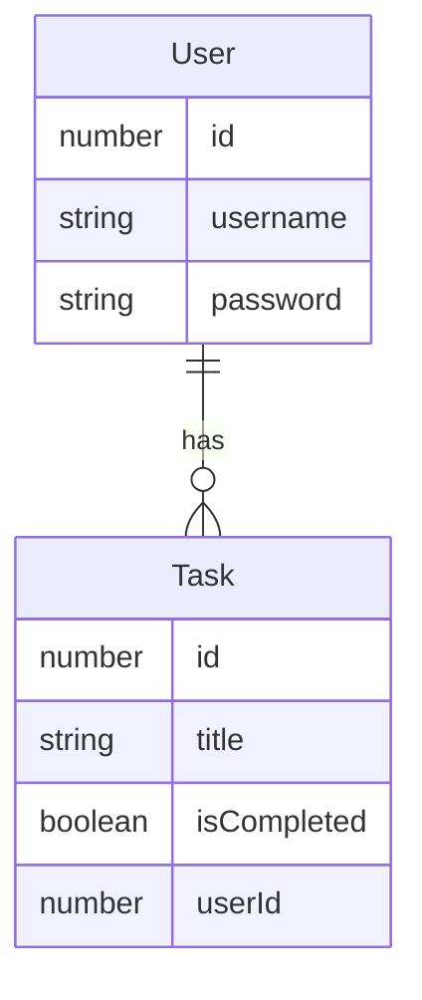

# Chuyên đề Clean Code cùng một số nguyên tắc trong lập trình: Ứng dụng Todo App

## Giới thiệu ứng dụng

Đây là một ứng dụng Todo App đơn giản, giúp người dùng quản lý công việc hàng ngày của mình.

Các chức năng của ứng dụng:

- Đăng ký tài khoản
- Đăng nhập
- Đăng xuất
- Xem danh sách công việc
- Thêm công việc mới
- Đánh dấu công việc đã hoàn thành
- Xóa công việc

Lược đồ quan hệ:



## Triển khai

### Môi trường

Ứng dụng được viết bằng JavaScript và chạy trên nền Node.js vì thế bạn cần cài đặt Node.js trước khi
chạy ứng dụng(Khuyến nghị sử dụng Node.js 20.x.x)

<https://nodejs.org/en/download/package-manager>

### Cài đặt

Sau khi cài đặt Node.js, bạn cần cài đặt các thư viện cần thiết cho ứng dụng bằng cách chạy lệnh sau
trong thư mục gốc của ứng dụng:

```bash
npm install
```

### Chạy ứng dụng

Để chạy ứng dụng trong môi trường development (có auto reload), bạn chạy lệnh sau:

```bash
npm run dev
```

Mặc định, ứng dụng sẽ chạy trên cổng 5500, mở trình duyệt và truy cập vào địa chỉ sau:

<http://localhost:5500>

Để chạy ứng dụng trong môi trường sản phẩm (production), bạn chạy lệnh sau:

```bash
npm start
```

## Bài tập

Tất cả các chức năng của ứng dụng này đã hoàn thành và hoạt động tương đối tốt. Tuy nhiên, mã nguồn
của ứng dụng chưa tuân thủ một số nguyên tắc trong lập trình và cần được cải thiện.

Nhiệm vụ của bạn là đọc mã nguồn của ứng dụng và cải thiện nó theo các nguyên tắc Clean Code.

Việc clean code phải đảm bảo các yêu cầu sau:

- Ứng dụng vẫn hoạt động đúng như trước
- Mã nguồn phải dễ đọc, dễ hiểu

Chỉ thực hiện chỉnh sửa trong file `services/auth.service.js` và đảm bảo không làm thay đổi bất cứ
interface nào.

> [!WARNING] Để cho đơn giản trong phạm vi thời gian một chuyên đề ứng dụng này đã bỏ qua một số
> nguyên tắc về bảo mật trong các chức năng như đăng ký, đăng nhập, xác thực người dùng.
>
> Vui lòng không sử dụng hoặc tham khảo các đoạn mã đã được ghi chú là không an toàn trong môi
> trường thực tế.
>
> Ví dụ về một đoạn cảnh báo:
>
> ```js
> // THIS IS JUST FOR DEMO PURPOSES, IN REAL APPS YOU SHOULD SIGN THE COOKIE WITH A SECRET KEY
> res.cookie('user', user.id, {httpOnly: true});
> ```
